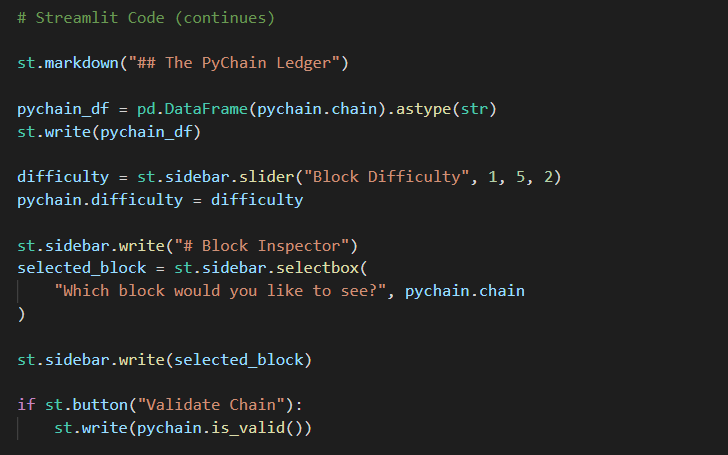
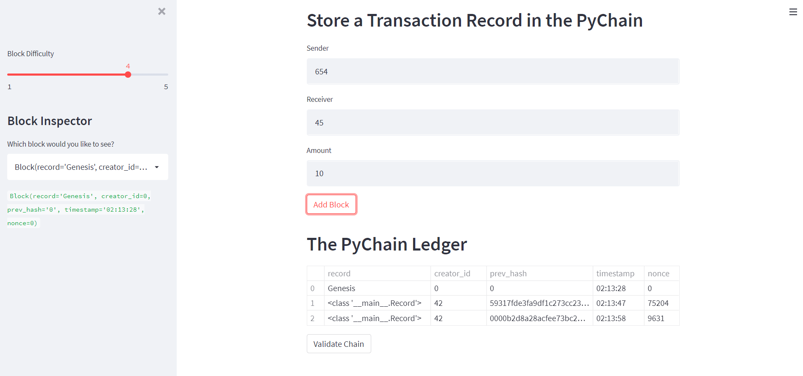

# module_18_challenge

Build a blockchain based ledger system by doing the following:

-Import libraries so we can make the necessary edits and upload the file to streamlit.

-Create formalized data with the record data class

-Create a Block data class to prepare and encode data

- create pychain data class to add prepare blockk to be hashed and added to blockchain

- Use streamlit to create a decentralized web app that code can de displayed and ran

